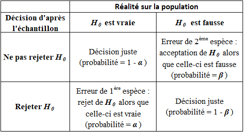

RESUME DU PROJET EN QLQ LIGNES

REMERCIEMENTS

```{r setup, include=FALSE}
knitr::opts_chunk$set(echo = FALSE, warning = FALSE, message = FALSE)
```

\maketitle
\tableofcontents

\newpage
# Introduction.

&nbsp;
La fraude est une pratique répandue dans de nombreux domaines comme par exemple la finance, le secteur social ou médical. Il peut être tentant pour un être humain ou une société de tricher si cela peut impliquer pour lui une position plus confortable dans la société, telle qu'une réduction de charges, ou même un avantage sur un de ses concurrents. Il semblerait donc logique que des personnes cherchent à déceler ces fraudes.

Les données transmises par un individu ou un organisme peuvent faire l'objet de modifications, c'est de ce type de fraudes auquel nous nous intéresserons ici, et plus particulièrement la modification du premier chiffre significatif (le premier chiffre d"un nombre qui n'est pas un zéro) de nombres pris dans un certain ensemble de données.

De telles modifications entraînent un changement de la répartition des chiffres présents naturellement[^n1]. Si nous connaissons la répartition des chiffres présentés dans un ensemble de données arbitraires, il est donc techniquement possible de savoir si un nombre a été modifié ou non. 

Il nous vient donc les questions suivantes: *Qu'elle est cette répartition ? Est-il possible de la connaître et si oui, dans quels cas ?* 

De manière intuitive nous pourrions penser que les nombres sont répartis de manière uniforme. Qu'en est-il vraiment ? 

La première partie de notre projet consistera à **répondre à ces questions**, nous nous appuierons sur les travaux de Simon Newcomb et Frank Benford, qui ont théorisé la **loi de Newcomb-Benford**, plus communément  appelée loi de Benford. 
Cette loi nous dit que, dans une liste de données dites naturelles, la probabilité d'avoir le chiffre $i$ comme premier chiffre significatif est de $log_{10}(1 + \frac{1}{i})$. 

Par exemple, le chiffre $1$ en tant que premier chiffre significatif serait présent à hauteur de $30\%$ alors que le $9$ à seulement $4,6\%$.

Dans la suite **nous mettrons en œuvre une série d'expérimentation** pour constater ou non la véracité de cette loi, pour ce faire dans un premier temps nous récolterons des nombres pris dans des milieux sensés satisfaire la loi de Newcomb-Benford et observerons la répartition du premier chiffre significatif. Puis nous répliquerons une version simplifiée de l’expérience de Hill (1988), qui consiste à observer la répartition du premier chiffre significatif d'une liste de nombre donnée au hasard par des êtres humains, en l'occurrence ses élèves. 

Cette expérience est à la base des méthodes de détection de fraudes par la loi de Newcomb-Benford. Si un fraudeur modifie un jeu de données, ce jeu est donc influencé par la pensée humaine, il ne suit donc plus la loi de Newcomb-Benford. Pour détecter la fraude il suffit donc de comparer les premiers chiffres significatifs. Cependant ces comparaisons doivent se faire de manière rigoureuses et scientifiques. Pour cela il existe des test statistiques, dont le plus connu, le test du $\chi^2$, ou bien celui de Ducharme et collab. (2020). 

Il nous vient donc les questions suivantes: *Ces tests sont-ils fiables ? Existe-t-il un test significativement meilleur que les autres ? Vont-ils dans le même sens ? Et sinon que faire ?*

La réponse à ces question constituera donc la deuxième partie de ce projet, pour ce faire nous mettrons en œuvre différents tests sur des jeux de données comme la fiscalité italienne.  

[^n1]: Les données dites naturelles sont celles qui n'ont pas été influencé par la pensée de l'homme.

\newpage

# Naissance de la loi de Newcomb-Benford. 

&nbsp;
Il serait tentant de penser que les nombres sont répartis de manière uniforme, cela viendrait du biais d'équiprobabilité[^n2]. Ce dernier consiste à "penser qu'en l'absence d'information, tous les cas ont la même probabilité de se produire et que le hasard implique nécessairement l’uniformité".  

Néanmoins cette hypothèse sera contredite une première fois par l'astronome, mathématicien, économiste et statisticien canadien Simon Newcomb. Ce dernier fournira en $1881$ une première approche au principe statistique, qui se fera injustement appeler *Loi de Benford*. Celui-ci remarquera que les premières pages des tables logarithmiques sont plus utilisées que les pages suivantes. Il publiera sa découverte dans un article de l'*"American Journal of Mathematics"*.  

Cette découverte mise de côté pendant plusieurs années, ce n'est qu'en $1938$ que l'ingénieur et physicien américain Frank Benford arrivera au même résultat après avoir répertorié des dizaines de milliers de données. Celui-ci pensera être le premier à l'initiative de cette loi, et c'est pour cette raison que la *loi de Newcomb-Benford* se fera plus généralement appelée *loi de Benford*.  

Cette loi nous dit que, dans une liste de données arbitraires, la probabilité d'avoir le chiffre $i$ comme premier chiffre significatif est de $log_{10}(1 + \frac{1}{i})$.  

\vspace{0.7cm}

```{r Benford}
library(kableExtra)
PCS<-c("1","2","3","4","5","6","7","8","9")
Benford<-c(rep(0,9))
for (i in 1:9)
  Benford[i]<-round(log(1+1/i,10),3)
kbl(rbind(PCS,Benford),booktabs="T",align="c") %>%
  kable_styling(latex_options=c("striped", "hold_position", "bordered", "condensed","responsive"), full_width=T) %>%
  column_spec(1,bold=T) %>%
  add_footnote(notation="none",c("","Tableau 1 : Répartition du premier chiffre significatif selon la loi de Newcomb-Benford."))
```

\vspace{0.7cm}

Nous retrouvons cette loi dans énormément de domaines comme les mathématiques, l'environnement, la finance, la physique, etc, plus précisément sur des données telles que la longueur des fleuves, la population des villes dans un pays, des déclarations de revenus, etc.  
Notons cependant qu'il existe des cas où les données ne suivent pas cette loi, notamment des données dites non naturelles qui seraient influencé par la pensée humaine (nombres premiers, nombres générés par des humains, etc).  

[^n2]: Défini en 1985 par Marie-Paule Lecoutre ([*source*](https://fr.wikipedia.org/wiki/Biais_d%27%C3%A9quiprobabilit%C3%A9)).

\newpage
# Expérimentation sur différents jeux de données.

&nbsp;
Après avoir pris connaissance de la **loi de Newcomb-Benford**, il serait intéressant de la mettre en pratique sur différents jeux de données.

## La suite de Fibonacci.   

&nbsp;
Intéressons-nous dans un premier temps à la suite de Fibonacci. 

Cette suite est une suite d'entiers dans laquelle chaque terme est la somme des deux termes qui le précèdent. Sa formulation est la suivante : $$F_{0} = 0, \, F_{1} = 1, \, \text{et} \, \forall \, n \ge 2, \, F_n = F_{n - 1} + F_{n - 2}.$$  

Nous commençons par recueillir les $1000$ premiers termes de la suite de Fibonacci, pour extraire le premier chiffre significatif de chacun de ces nombres.

```{r, Fibonacci}
F<-(c(rep(0,1000)))
F[2]<-1
for (i in 3:1000)
F[i]<-F[i-2]+F[i-1]
```

```{r PCS}
for (i in 1:1000){
  while(F[i]>=10)
    F[i]=F[i]/10
}
pcs<-floor(F)
```

Par la suite nous calculons la répartition de chaque chiffre significatif et obtenons l'histogramme suivant :  

```{r benford}
comp<-c(rep(0,9))
for (i in 1:9){
  for (j in 1:300){
  if (pcs[j]==i)
  comp[i]<-comp[i]+1
  }
}
Proba<-c(rep(0.0000000,9))
for (i in 1:9)
  Proba[i]<-round(comp[i]/length(pcs-1),4)

PCS<-c(1:9)
Benford<-c(rep(0,9))
for (i in 1:9)
  Benford[i]<-log(1+1/i,10)
#knitr::kable(cbind(PCS,Proba,Benford),booktabs="T",align="c")
```


Il semblerait que la répartition des chiffres significatifs des $300$ premiers nombres de la suite de Fibonacci suive la **loi de Newcomb-Benford**.  

\newpage
## Nombres extraits d'un magazine et d'un journal.

&nbsp;
Dans un second temps, nous relevons les prix présents dans un magazine de mobilier de la marque *AMPM*, ainsi que tous les nombres répertoriés dans un journal *Les ECHOS*. Nous récoltons environ $300$ nombres par magazine et, de la même façon qu'énoncé précédemment, calculons la répartition des chiffres significatifs de ces nombres.  


La répartition des chiffres significatifs des prix du magazine *AMPM* parait fortement similaire à celle de la **loi de Newcomb-Benford**. Nous constatons tout de même une légère différence pour le chiffre $3$.  

Observons maintenant la répartition des données issues du journal *Les ECHOS*.  


Nous remarquons ici la même tendance décroissante. Cependant les proportions des chiffres significatifs entre les données du journal et celles de la **loi de Newcomb-Benford** sont relativement différentes.  

## Population des villes de France.  

&nbsp;
Dans ce paragraphe nous nous intéressons à la population des villes françaises. À l'aide des données de l'*INSEE*, nous répertorions environ $35000$ premiers chiffres significatifs et regardons leur répartition.  


Ici les répartitions sont fortement ressemblantes, c'est aussi le cas pour de nombreuses données démographiques naturelles. Nous aurions pu également analyser les codes postaux, la longueur des rivières ou encore la distance des villes de France à Paris.  

\newpage
## Passage journalier de vélos dans l'allée Beracasa à Montpellier.  

&nbsp;
La ville de Montpellier étant en pleine transition écologique, elle ouvre de plus en plus l'accès aux vélos sur ses routes. Pour en mesurer l'impact, elle a mit en place des éco-compteurs dans plusieurs rues. Les données issues de ces compteurs sont en libre accès, nous nous sommes donc intéressés au nombre de passages journaliers de vélos dans l'allée Beracasa sur une année.  

Nous obtenons la répartition suivante :  


Dans ce cas la proportion du chiffre $1$ est de plus de $50 \%$ contre $30 \%$ pour la **loi de Newcomb-Benford**. La différence de répartition des chiffres $2, 3, 4, 5$ est aussi notable, elle est même environ $2$ fois moins élevée.  

Visuellement, nous pourrions penser que la répartition de ces données ne suit pas la **loi de Newcomb-Benford**. Il est courant de ne pas retrouver la loi de Newcomb-Benford dans des données brutes comme celles-ci, on la retrouve empiriquement plus souvent dans des données dîtes de **deuxième génération** comme des sommes ou des produits. Ceci à été démontré par Jeff Boyle en $1994$.


## Nombres générés par les humains  

&nbsp;
Dans ce paragraphe nous tentons de reproduire à moindre échelle l'expérience de Theodore Preston Hill en $1988$. Dans le cadre de son expérience le professeur Ted HILL demande à ses élèves ($742$) d'écrire un nombre de $6$ chiffres au hasard sur un bout de papier, il recense ensuite le premier chiffre significatif de chacun de ces nombre dans le but de les comparer à la loi de Benford et à la répartition uniforme.

Notre expérience partageant le même objectif que celle de HILL, est basée sur un protocole légèrement différent. N'ayant pas une troupe d'élèves à disposition nous avons recueilli un total de $300$ nombres. Ces $300$ nombres ont été obtenus de plusieurs manières, via des sondages sur internet ou réseaux sociaux, en demandant directement à des personnes rencontrées au hasard, notre famille ou nos amis. 

D'après le biais d'équiprobabilité cité plus haut, si les nombres recensés pendant les expériences ont réellement été données de façon aléatoire les répartitions des premiers chiffres significatifs devraient être comparable à une loi uniforme.

Comparons les répartitions obtenues durant les deux expériences:


À première vue, dans les deux expériences la répartition du premier chiffre significatif ne semble pas suivre la loi de Newcomb-Benford (le chiffre $1$ n'apparaît clairement pas aussi souvent par exemple), elles semblent cependant plus proche de la loi uniforme sans tout de même y correspondre parfaitement. Plusieurs facteurs pourraient expliquer ces différences entre l'uniforme et les expériences, celui qui revient souvent est qu'un nombre donné au hasard par un humain est souvent influencé par son expérience, même inconsciemment. Par exemple sa date d'anniversaire, un évènement marquant ou son chiffre préféré. Le fait d'avoir recueilli nos nombres par internet à aussi pu influencer le choix des personnes concernées. Un facteur psychologique est donc à prendre en considération pour approfondir la conclusion.

Après avoir observé ces quelques jeux de données, nous étions en mesure de dire si ces données semblaient ou non suivre la loi de Newcomb-Benford, le problème qui en découle est qu'une simple observation n'est pas très fiable, difficile de prendre une décision sur un constat visuel. En effet, se tromper dans l'interprétation peut entraîner deux types d'erreur, la première étant de faussement déceler une fraude (ce que nous appellerons **le risque de première espèce**) et la deuxième de laisser passer une fraude. Ces erreurs ont un coût pour l'institut qui essaye de les réprimer, celui d'engager des démarches de détections approfondies inutiles ou de ne pas percevoir les taxes dues dans le cas de la fraude fiscale par exemple. 

Le but est donc de minimiser le coût que peuvent engendrer les erreurs sus-mentionnées, pour ce faire l'utilisation d'outils scientifiques est de rigueur. Les outils que nous arboderons dans la suite sont les test d'adéquations, ces tests servent à vérifier si un ensemble de nombre suit ou non une loi de probabilité donnée (pour nous c'est la loi de Newcomb-Benford).


En stat l'erreur de 1ere espèce est souvent plus présente
On se dit pas qu'il y a fraude on suspecte la fraude on lance une audit (ca coute des sous)
dans tous les cas on risque de faire une erreur (mettre le tableau)

# Tests

## Généralités sur les tests

&nbsp;
Un test d'hypothèse (ou test statistique) est un procédé d'inférence statistique ayant pour but de fournir une règle de décision permettant ainsi, à partir de l'étude d'un ou plusieurs échantillons de données, d'indiquer si une hypothèse statistique concernant une population doit être acceptée ou rejetée.  

Nous distinguons deux classes de tests :   

- Les tests paramétriques sont l'étude de la moyenne, variance, ou de la fréquence des observations issues d'une distribution a priori paramétrée. Ils nécessitent un modèle à fortes contraintes (normalité des distributions ou approximation normale pour de grands échantillons). Ces hypothèses sont d'autant plus difficiles à vérifier que les effectifs étudiés sont plus réduits.    
- Les tests non paramétriques sont l'étude des rangs des observations issues d'une distribution non paramétrée mais quelconque. Ce sont des tests dont le modèle ne précise pas les conditions que doivent remplir les paramètres de la population dont a été extrait l'échantillon. Il n'y a donc pas d'hypothèse de normalité au préalable.  

Lorsque les conditions nécessaires sont valides, les tests paramétriques sont plus puissants que les tests non paramétriques. Les tests non paramétriques s'utilisent dès lors que les conditions d'application des autres méthodes ne sont pas satisfaites, même après d'éventuelles transformations de variables, et peuvent être employés pour des échantillons de taille très faible.  

Comme nous l'avons précédemment énoncé, une inspection visuelle à elle seule ne permet pas d'affirmer ou infirmer si un jeu de données suit la loi de Newcomb-Benford. L'outil statistique permettant de le vérifier est le test d'adéquation à la loi de Newcomb-Benford.  
Les tests d'adéquation servent à tester si un échantillon est distribué selon une loi de probabilité préalablement choisie. Ils permettent de décider, avec un certain seuil d'erreur, si les écarts présentés par l'échantillon par rapport aux valeurs théoriques sont dus au hasard, ou si au contraire ils sont significatifs.  

## Hypothèse nulle et hypothèse alternative

&nbsp;
Un test statistique étudie deux hypothèses opposées concernant une population : l'hypothèse nulle et l'hypothèse alternative.  
L'hypothèse nulle, notée $H_0$, est l'hypothèse que l'on souhaite contrôler, elle repose sur le fait de dire qu'il n'existe pas de différence entre les paramètres comparés ou que la différence observée n'est pas significative et résulte des fluctuations d'échantillonnage. Cette hypothèse est formulée dans le but d'être rejetée.  

L'hypothèse alternative, notée $H_1$, affirme qu'un paramètre de la population est plus petit, plus grand ou différent de la valeur hypothétisée dans l'hypothèse nulle. Elle peut être vue comme la négation de $H_0$ et est équivalente à dire que $H_0$ est fausse. La décision de rejeter $H_0$ signifie que $H_1$ est réalisée ou que $H_1$ est vraie.  

Cependant, la décision d'accepter l'hypothèse nulle n'est pas équivalente à dire que $H_0$ est vraie et que $H_1$ est fausse, mais cela traduit uniquement l'idée selon laquelle il n'y a pas d'évidence nette pour que $H_0$ soit fausse. Finalement un test conclu à rejeter ou à ne pas rejeter l'hypothène nulle mais jamais à l'accepter directement.

## Les risques d'erreurs

&nbsp;
Notons alors qu'aucun test d'hypothèse n'est fiable à $100 \%$, un test étant basé sur des probabilités, il existe toujours un risque de tirer une mauvaise conclusion. Lorsqu'un test d'hypothèse est effectué, nous pouvons observer deux types d'erreurs, l'erreur de Type I dite erreur de première espèce et l'erreur de Type II dite erreur de seconde espèce. Les risques de ces deux erreurs sont inversement proportionnels et sont déterminés par le seuil de signification (ou région critique) et la puissance du test. Il est important de déterminer l'erreur qui présente les conséquences les plus graves dans notre cas avant de définir le risque que nous accepterons pour chaque erreur.  

L'erreur de Type I consiste à rejeter l'hypothèse nulle alors que celle-ci est vraie. La probabilité de commettre une erreur de première espèce est représentée par $\alpha$, qui désigne le seuil de signification défini pour le test d'hypothèse. Un niveau $\alpha$ de $0.05$ indique que nous sommes disposé à avoir $5 \%$ de chances de rejeter l'hypothèse nulle à tort. Pour réduire ce risque, il est possible d'utiliser une valeur $\alpha$ plus faible. Cependant, cela implique d'être moins à même de détecter une vraie différence si celle-ci existe vraiment.  
Dans notre contexte, l'erreur de Type I consiste à affirmer que les données ne suivent pas la loi de Newcomb-Benford alors que c'est le cas, soit faussement identifier une fraude.

L'erreur de Type II repose sur le fait de ne pas rejeter l'hypothèse nulle alors que celle-ci est fausse. La probabilité de commettre une erreur de seconde espèce est notée $\beta$, et dépend de la puissance du test. Il est possible de réduire le risque de deuxième espèce en faisant en sorte que le test soit suffisamment puissant. Pour cela, il est nécessaire que l'effectif d'échantillon soit suffisamment grand pour permettre la détection d'une différence réelle.  
La probabilité de rejeter l'hypothèse nulle à tort vaut $1 - \beta$, il s'agit de la puissance du test.  




\newpage

PARLER DES TESTS DE MANIERE GENERALE, plutot theorique

le test privilégié est le test de chi2
quand c'est une problème qui a une certaine importance pleins d'autres tests qui existent (package R Benford test le seul test important dans ce package est celui du Chi2, 2ème package Benford smooth test créé par samuel et credo plus spécifique au problème disponible sur le site CRAN) Les deuxièmes tests sont mieux car plus puissantes, cad qu'ils détectent plus de fraudes. On veut le test le plus puissant possible, a 5%
faire une description des outils/tests

données fiscales sur plusieurs années de 20 régions italiennes, test de chi2 (c'est pas un test très puissant, ne permet pas nécessairement de détecter les fraudes.) Il ont mis que la statistique de test mais pas la p-value

# Application des tests

## Application a des données fiscales italiennes

## CAS COVID

Un chinois a affirmé qu'il n'y avait pas eu fraudes en Chine

# Bibliographie

V. GENEST, C. GENEST *La loi de Newcomb-Benford ou la loi du premier chiffre significatif* ($2011$)

WIKIPEDIA L'ENCYCLOPEDIE LIBRE *Loi de Benford* (dernière mise à jour $2021$)

T. P. HILL *Random-number guessing and the first digit phenomenon* ($1988$)

G. R. DUCHARME, S. KACI, C. VOVOR-DASSU *Tests d'adéquations lisses pour la loi de Newcomb-Benford* ($2017$)

M. AUSLOOS, R. CERQUETI, T. A. MIR *Data science for assessing possible tax income manipulation: the case of Italy* ($2017$)
