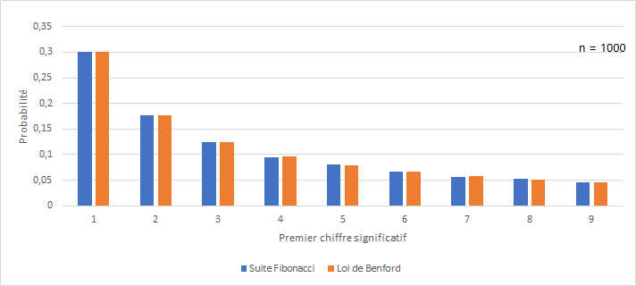

RESUME DU PROJET EN QLQ LIGNES

REMERCIEMENTS

\maketitle
\tableofcontents

\newpage
# Introduction.

&nbsp;
La fraude est une pratique répandue dans de nombreux domaines comme par exemple la finance, le secteur social ou médical. Il peut être tentant pour un être humain ou une société de tricher si cela peut impliquer pour lui une position plus confortable dans la société, telle qu'une réduction de charges, ou même un avantage sur un de ses concurrents. Il semblerait donc logique que des personnes cherchent à déceler ces fraudes.

Les données transmises par un individu ou un organisme peuvent faire l'objet de modifications, c'est de ce type de fraudes auquel nous nous intéresserons ici, et plus particulièrement la modification du premier chiffre significatif (le premier chiffre d"un nombre qui n'est pas un zéro) de nombres pris dans un certain ensemble de données.

De telles modifications entraînent un changement de la répartition des chiffres présents naturellement[^n1]. Si nous connaissons la répartition des chiffres présentés dans un ensemble de données arbitraires, il est donc techniquement possible de savoir si un nombre a été modifié ou non. 

Il nous vient donc les questions suivantes: *Qu'elle est cette répartition ? Est-il possible de la connaître et si oui, dans quels cas ?* 

De manière intuitive nous pourrions penser que les nombres sont répartis de manière uniforme. Qu'en est-il vraiment ? 

La première partie de notre projet consistera à **répondre à ces questions**, nous nous appuierons sur les travaux de Simon Newcomb et Frank Benford, qui ont théorisé la **loi de Newcomb-Benford**, plus communément  appelée loi de Benford. 
Cette loi nous dit que, dans une liste de données dites naturelles, la probabilité d'avoir le chiffre $i$ comme premier chiffre significatif est de $log_{10}(1 + \frac{1}{i})$. 

Par exemple, le chiffre $1$ en tant que premier chiffre significatif serait présent à hauteur de $30\%$ alors que le $9$ à seulement $4,6\%$.

Dans la suite **nous mettrons en œuvre une série d'expérimentation** pour constater ou non la véracité de cette loi, pour ce faire dans un premier temps nous récolterons des nombres pris dans des milieux sensés satisfaire la loi de Newcomb-Benford et observerons la répartition du premier chiffre significatif. Puis nous répliquerons une version simplifiée de l’expérience de Hill (1988), qui consiste à observer la répartition du premier chiffre significatif d'une liste de nombre donnée au hasard par des êtres humains, en l'occurrence ses élèves. 

Cette expérience est à la base des méthodes de détection de fraudes par la loi de Newcomb-Benford. Si un fraudeur modifie un jeu de données, ce jeu est donc influencé par la pensée humaine, il ne suit donc plus la loi de Newcomb-Benford. Pour détecter la fraude il suffit donc de comparer les premiers chiffres significatifs. Cependant ces comparaisons doivent se faire de manière rigoureuses et scientifiques. Pour cela il existe des test statistiques, dont le plus connu, le test du $\chi^2$, ou bien celui de Ducharme et collab. (2020). 

Il nous vient donc les questions suivantes: *Ces tests sont-ils fiables ? Existe-t-il un test significativement meilleur que les autres ? Vont-ils dans le même sens ? Et sinon que faire ?*

La réponse à ces question constituera donc la deuxième partie de ce projet, pour ce faire nous mettrons en œuvre différents tests sur des jeux de données comme la fiscalité italienne.  

[^n1]: Les données dites naturelles sont celles qui n'ont pas été influencé par la pensée de l'homme.

\newpage

# Naissance de la loi de Newcomb-Benford. 

&nbsp;
Il serait tentant de penser que les nombres sont répartis de manière uniforme, cela viendrait du biais d'équiprobabilité[^n2]. Ce dernier consiste à "penser qu'en l'absence d'information, tous les cas ont la même probabilité de se produire et que le hasard implique nécessairement l’uniformité".  

Néanmoins cette hypothèse sera contredite une première fois par l'astronome, mathématicien, économiste et statisticien canadien Simon Newcomb. Ce dernier fournira en $1881$ une première approche au principe statistique, qui se fera injustement appeler *Loi de Benford*. Celui-ci remarquera que les premières pages des tables logarithmiques sont plus utilisées que les pages suivantes. Il publiera sa découverte dans un article de l'*"American Journal of Mathematics"*.  

Cette découverte mise de côté pendant plusieurs années, ce n'est qu'en $1938$ que l'ingénieur et physicien américain Frank Benford arrivera au même résultat après avoir répertorié des dizaines de milliers de données. Celui-ci pensera être le premier à l'initiative de cette loi, et c'est pour cette raison que la *loi de Newcomb-Benford* se fera plus généralement appelée *loi de Benford*.  

Cette loi nous dit que, dans une liste de données arbitraires, la probabilité d'avoir le chiffre $i$ comme premier chiffre significatif est de $log_{10}(1 + \frac{1}{i})$.  

\vspace{0.7cm}

\begin{tabu} to \linewidth {>{}l>{\centering}X>{\centering}X>{\centering}X>{\centering}X>{\centering}X>{\centering}X>{\centering}X>{\centering}X>{\centering}X}
\toprule
\textbf{\cellcolor{gray!6}{PCS}} & \cellcolor{gray!6}{1} & \cellcolor{gray!6}{2} & \cellcolor{gray!6}{3} & \cellcolor{gray!6}{4} & \cellcolor{gray!6}{5} & \cellcolor{gray!6}{6} & \cellcolor{gray!6}{7} & \cellcolor{gray!6}{8} & \cellcolor{gray!6}{9}\\
\textbf{Benford} & 0.301 & 0.176 & 0.125 & 0.097 & 0.079 & 0.067 & 0.058 & 0.051 & 0.046\\
\bottomrule
\multicolumn{10}{l}{\textsuperscript{} }\\
\multicolumn{10}{l}{\textsuperscript{} Tableau 1 : Répartition du premier chiffre significatif selon la loi de Newcomb-Benford.}\\
\end{tabu}

\vspace{0.7cm}

Nous retrouvons cette loi dans énormément de domaines comme les mathématiques, l'environnement, la finance, la physique, etc, plus précisément sur des données telles que la longueur des fleuves, la population des villes dans un pays, des déclarations de revenus, etc.  
Notons cependant qu'il existe des cas où les données ne suivent pas cette loi, notamment des données dites non naturelles qui seraient influencé par la pensée humaine (nombres premiers, nombres générés par des humains, etc).  

[^n2]: Défini en 1985 par Marie-Paule Lecoutre ([*source*](https://fr.wikipedia.org/wiki/Biais_d%27%C3%A9quiprobabilit%C3%A9)).

\newpage
# Expérimentation sur différents jeux de données.

&nbsp;
Après avoir pris connaissance de la **loi de Newcomb-Benford**, il serait intéressant de la mettre en pratique sur différents jeux de données.

## La suite de Fibonacci.   

&nbsp;
Intéressons-nous dans un premier temps à la suite de Fibonacci. 

Cette suite est une suite d'entiers dans laquelle chaque terme est la somme des deux termes qui le précèdent. Sa formulation est la suivante : $$F_{0} = 0, \, F_{1} = 1, \, \text{et} \, \forall \, n \ge 2, \, F_n = F_{n - 1} + F_{n - 2}.$$  

Nous commençons par recueillir les $1000$ premiers termes de la suite de Fibonacci, pour extraire le premier chiffre significatif de chacun de ces nombres.

Par la suite nous calculons la répartition de chaque chiffre significatif et obtenons l'histogramme suivant :  

Il semblerait que la répartition des chiffres significatifs des $300$ premiers nombres de la suite de Fibonacci suive la **loi de Newcomb-Benford**.  

\newpage
## Nombres extraits d'un magazine et d'un journal.

&nbsp;
Dans un second temps, nous relevons les prix présents dans un magazine de mobilier de la marque *AMPM*, ainsi que tous les nombres répertoriés dans un journal *Les ECHOS*. Nous récoltons environ $300$ nombres par magazine et, de la même façon qu'énoncé précédemment, calculons la répartition des chiffres significatifs de ces nombres.  

La répartition des chiffres significatifs des prix du magazine *AMPM* parait fortement similaire à celle de la **loi de Newcomb-Benford**. Nous constatons tout de même une légère différence pour le chiffre $3$.  

Observons maintenant la répartition des données issues du journal *Les ECHOS*.  

Nous remarquons ici la même tendance décroissante. Cependant les proportions des chiffres significatifs entre les données du journal et celles de la **loi de Newcomb-Benford** sont relativement différentes.  

## Population des villes de France.  

&nbsp;
Dans ce paragraphe nous nous intéressons à la population des villes françaises. À l'aide des données de l'*INSEE*, nous répertorions environ $35000$ premiers chiffres significatifs et regardons leur répartition.  

Ici les répartitions sont fortement ressemblantes, c'est aussi le cas pour de nombreuses données démographiques naturelles. Nous aurions pu également analyser les codes postaux, la longueur des rivières ou encore la distance des villes de France à Paris.  

\newpage
## Passage journalier de vélos dans l'allée Beracasa à Montpellier.  

&nbsp;
La ville de Montpellier étant en pleine transition écologique, elle ouvre de plus en plus l'accès aux vélos sur ces routes. Pour en mesurer l'impact, elle a mit en place des éco-compteurs dans plusieurs rues. Les données issues de ces compteurs sont en libre accès, nous nous sommes donc intéressés au nombre de passages journaliers de vélos dans l'allée Beracasa sur une année.  

Nous obtenons la répartition suivante :  

Dans ce cas la proportion du chiffre $1$ est de plus de $50 \%$ contre $30 \%$ pour la **loi de Newcomb-Benford**. La différence de répartition des chiffres $2, 3, 4, 5$ est aussi notable, elle est même environ $2$ fois moins élevée.  
Visuellement, nous pourrions penser que la répartition de ces données ne suit pas la **loi de Newcomb-Benford**. Il est courant de ne pas retrouver la loi de Newcomb-Benford dans des données brutes commme celles-ci, on la retrouve empiriquement plus souvent dans des données dîtes de **deuxième génération** comme des sommes ou des produits.

## Nombres générés par les humains.  

Après avoir observé ces quelques jeux de données, nous étions en mesure de dire si ces données semblaient ou non suivre la loi de Newcomb-Benford, le problème qui en découle est qu'une simple observation n'est pas très fiable, difficile de prendre une décision sur un constat visuel. En effet, se tromper dans l'interprétation peut entrainer deux types d'erreur, la première étant de faussement déceler une fraude (ce que nous appelerons **le risque de première espèce**) et la deuxième de laisser passer une fraude. Ces erreurs ont un coût pour l'institut qui essaye de les réprimer, celui d'engager des démarches de détections approffondies inutiles ou de ne pas percevoir les taxes dues dans le cas de la fraude fiscale par exemple. 

Le but est donc de minimiser le coût que peuvent engendrer les erreurs sus-mentionnées, pour se faire l'utilisation d'outils scientifiques est de rigeur. Les outils que nous arboderons dans la suite sont les test d'adéquations, ces tests servent à vérifier si un ensemble de nombre suit ou non une loi de probabilité donnée (pour nous c'est la loi de Newcomb-Benford). 

TRANSITION AVEC LES TESTS
Une inspection visuelle ne suffit pas, 
l'outil pour ça c'est les tests d'adéquation à la loi de Benford
erreur 1ere espèce rejeter Ho (c'est dire que c'est pas benford alors que ca l'est, dire qu'il y a fraude alors que non)
erreur seconde espece (ne pas rejeter H0 à tord, laisser passer une fraude)
En stat l'erreur de 1ere espèce est souvent plus présente
On se dit pas qu'il y a fraude on suspecte la fraude on lance une audit (ca coute des sous)
dans tous les cas on risque de faire une erreur (mettre le tableau)

# Tests

PARLER DES TESTS DE MANIERE GENERALE, plutot theorique

le test privilégié est le test de chi2
quand c'est une problème qui a une certaine importance pleins d'autres tests qui existent (package R Benford test le seul test important dans ce package est celui du Chi2, 2ème package Benford smooth test créé par samuel et credo plus spécifique au problème disponible sur le site CRAN) Les deuxièmes tests sont mieux car plus puissantes, cad qu'ils détectent plus de fraudes. On veut le test le plus puissant possible, a 5%
faire une description des outils/tests

données fiscales sur plusieurs années de 20 régions italiennes, test de chi2 (c'est pas un test très puissant, ne permet pas nécessairement de détecter les fraudes.) Il ont mis que la statistique de test mais pas la p-value

# Application des tests

## Application a des données fiscales italiennes

## CAS COVID

Un chinois a affirmé qu'il n'y avait pas eu fraudes en Chine

# Bibliographie
